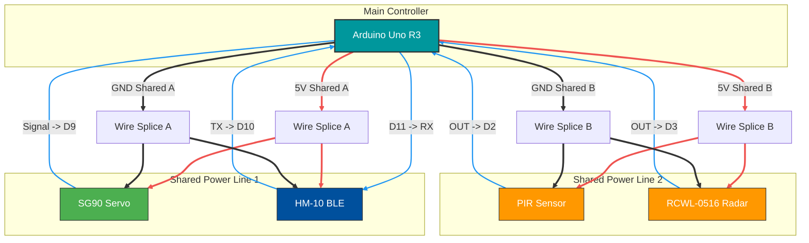

## Ency - Smart Power Automation

<p align="center" style="margin-top: 2rem"><br>
  
</p>

Ency is a full-stack IoT solution that automates room power using Bluetooth Low Energy (BLE) proximity detection and motion sensing. It consists of a React Native (Expo) mobile app with native Kotlin background services and an Arduino hardware controller.

## Features

- **Hybrid Sensor Fusion:** The system uses an **"OR" Logic Gate** approach. Lights stay on if _any_ of these are true:

  1.  Phone is in the room (BLE Ping).
  2.  PIR Sensor detects major movement (Walking).
  3.  Radar Sensor detects subtle movement (Breathing/Typing).

- **Deep Sleep Resilience:** Uses a custom **Kotlin Native Module** with a partial `WakeLock` to bypass Android battery optimizations, ensuring the phone keeps pinging even in "Doze Mode."

- **Jitter-Free Servo Control:** Custom C++ logic attaches the servo _only_ during movement and detaches immediately after to prevent mechanical buzzing and noise.

## Hardware Tech Stack

Microcontroller: Arduino Uno R3

Communication: HM-10 BLE Module (CC2541)

Actuator: SG90 Micro Servo (Mechanical Switch Control)

Sensors:

RCWL-0516 (Doppler Microwave Radar - for subtle movement)

PIR Sensor (HC-SR501 - for major movement)

## Circuit Diagram



## Pin Configuration

| Component      | Pin Label       | Arduino Pin | Notes                    |
| :------------- | :-------------- | :---------- | :----------------------- |
| **SG90 Servo** | Signal (Orange) | **D9**      | PWM Control              |
|                | VCC / GND       | 5V / GND    | _Shares wire with HM-10_ |
| **HM-10 BLE**  | TX              | **D10**     | Connects to Arduino RX   |
|                | RX              | **D11**     | Connects to Arduino TX   |
|                | VCC / GND       | 5V / GND    | _Shares wire with Servo_ |
| **PIR Sensor** | OUT             | **D2**      | Trigger 1                |
|                | VCC / GND       | 5V / GND    | _Shares wire with Radar_ |
| **RCWL-0516**  | OUT             | **D3**      | Trigger 2                |
|                | VIN / GND       | 5V / GND    | _Shares wire with PIR_   |

## Arduino Firmware Logic

The firmware is written in **C++**. It handles the physical actuation and acts as the central decision maker.

#### 1. Decision Algorithm

The loop runs continuously and checks three inputs. If **ANY** input is high, the timer resets.

```cpp
if (phoneStatus || (pirStatus == HIGH) || (radarStatus == HIGH)) {
    // 1. Reset the timer
    lastHeartbeatTime = millis();

    // 2. If the light is OFF, turn it ON
    if (!currentDormState) {
        onSwitch();
    }
}
```

#### 2. The Timeout (Watchdog)

If the user leaves the room (Phone disconnects) AND no motion is detected for timeout duration, the system saves energy.

```cpp
// If light is ON... and Time > timeout duration and No Sensors Active...
if (currentDormState) {
    if ((millis() - lastHeartbeatTime > TIMEOUT_DURATION) && (pirStatus == LOW) && (radarStatus == LOW)) {
        closeSwitch(); // Turn OFF
    }
}
```

#### 3. Noise Reduction (Servo Detach)

Cheap servos (like the SG90) often "jitter" or hum when holding a position. The code fixes this by cutting power to the signal pin once the movement is done.

```cpp
void onSwitch() {
  switchServo.attach(SERVO_PIN); // Connect
  // ... Move Servo ...
  delay(100);
  switchServo.detach(); // Disconnect immediately to stop noise
}
```

## App Architecture

This project moves beyond standard React Native limitations by implementing a Bare Workflow with native modules.

The Problem
Standard Android apps kill background JavaScript tasks after a few minutes to save battery. This caused the lights to turn off unexpectedly when the phone was in the pocket.

The Solution: SmartSwitchService.kt
Wrote a custom Native Android Service in Kotlin that handles the connection independently of the JS thread.

Handover Protocol: The React Native UI handles the initial scan and pairing. It then passes the MAC address to the Native Module.

Foreground Service: The app launches a High-Priority Foreground Service (visible via the "Active Apps" menu).

Partial WakeLock: The service acquires a PARTIAL_WAKE_LOCK, forcing the CPU to stay awake for the 15-second heartbeat loop, even if the screen is off.

Auto-Recovery: If the Bluetooth connection hangs (e.g., user walks out of range), a custom withTimeout coroutine forces a reset, ensuring the app reconnects instantly upon return.

## Installation & Setup

#### Prerequisites

Node.js & npm

Android Studio (with SDK 34 installed)

Arduino IDE

#### Steps

Clone the Repository

```bash
git clone https://github.com/pranava-mohan/ency.git
cd ency
```

First upload arduino/hm10_setup/hm10_setup.ino to the Arduino Uno R3.

Then upload arduino/ency_beacon/ency_beacon.ino to the Arduino Uno R3.

#### Install Dependencies

React Native app folder is ency-app

```bash
npm install
```

Build the Native Client Note: You cannot use "Expo Go" because this project contains custom Native Code.

```bash
npx expo run:android
```
